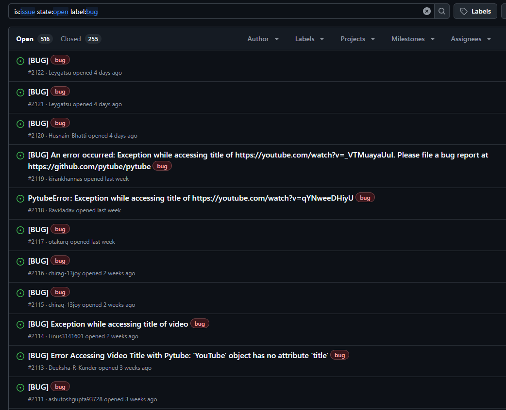

## What
Provide video/ audio content and obtain a "text version" of the content.

Currently supports only youtube links but other sources e.g. bilibili, spotify podcasts etc. can be easily added (given if I continue to work on the project)

## When
From Oct - Nov 24 (during my job search), took ~ 50-80 hours on and off (there were a lot of issues during development)

## Why

Youtube keeps recommending 284825 bazillion video essays/ podcasts for me (each of length 9893242 minutes) and I don't have time to watch them all ¯\\_(ツ)_/¯.

Some platforms (e.g. youtube) already implemented AI summary features, the summary produced is too brief for it to be a replacement for watching the video itself (time consuming)

### Why don't you read instead?
- "Modality" should be decoupled from "information" in a piece of content:
    - Audiobooks/ NotebookLM converts written text material to audio
    - (???) converts
- Some podcasts contain "exclusive" information availiable to me (in reasonable amount of time/ resources) nowhere else.

## How

The project can be disected (and ordered) into 3 main sections:
1. Obtaining media from url
2. Transcribe media into transcript
3. "Summarize" written media to written version

### Obtaining media from url

We download youtube videos with [pytubefix](https://github.com/JuanBindez/pytubefix) and bili videos from [bilix](https://github.com/HFrost0/bilix). 

We wrap each of them into a function f: url --> path/to/media, this is not ideal but works well enough for our use case ¯\\_(ツ)_/¯

#### [Pytube](https://github.com/pytube)

> TL;DR: Doesn't work, use pytubefix instead

This library will be the first result when searching "Download youtube video python". 

Unfortunately, the library is littered with issues, and doesn't work for me (and many others). I literally cannot download any media following the tutorial on the docs line by line.

*Figure 1: Unfortunate souls being failed by pytube*

[Pytubefix](https://github.com/JuanBindez/pytubefix) was mentioned in one of the issues (can't find it unfortunately), installed that in place of pytube and got everything smooth sailing. Took me half an hour to realized its not my fault.

#### Media management

I made 3 folders to place the content in it's different "phrases" of processing, there is a lot of string manipulation/ exception checking (with `os` module, mostly existence checking) and took longer then expected to implement.

### Media transcription 

We use [whisperX](https://github.com/m-bain/whisperX) for transcription, in the demo, we use a hosted version ([replicate](https://replicate.com/victor-upmeet/whisperx)) instead. But we also coded a locally ran version (which can be replaced in-place of the hosted version)

#### Pre-processing: converting to wav

WhisperX (both hosted and local version) require the input file to be in WAV format. 

I tried different python libraries for doing this conversion, but it turns out all of them are just `FFMPEG` wrappers, so decided to use `FFMPEG` directly instead (using `subprocess` module).

#### Cloud transcription & File hosting
The [replicate page](https://replicate.com/victor-upmeet/whisperx) for whisperX contains example python code for getting the transcription.

Unfortunately, you cannot pass in audio that are too large (~20MB) via the client directly ([Unexpected behavior](https://github.com/replicate/replicate-python/issues/135#issuecomment-2018529395), no plans for fixing it) as shown in the demo code. 

The "correct way" of doing it is to provide the link to the audio instead if it's size is too large, and I got it working by using [0x0.st](https://0x0.st/) (for demoing only, will self-host this if I run this at scale, not gonna leech lmao).

Here are some other approaches that I tried before that:
- [Self hosting](https://github.com/replicate/replicate-python/issues/395) the media directly from my machine (learned how to port forward in the process)
- Other file uploading websites (got working link with audio but someone not workign with replicate)
- S3 based file uploading service ([Wasabi](https://wasabi.com/)), got the code to work, but it turns out you need to be a paying customer to "expose" files publicly, and using it as a CDN kinda breaks their ToS, so I stopped using it.

### Transcription

After the transcription is obtained, I format the results into a "pretty printed" string, and then feed into a LLM (served via openrouter) to get a response

For the prompt, I literally just threw in my requirements to Claude and have it come up with a prompt, it works well mostly but some behavior is not desirable (omitting information/ talking points occationally, mispelling of people etc).

If I continue to work on the project, I can probably provide some examples in the prompt (and it will probably work), current results work well enough, and will probably also provide metadata like video description/ channel description along with the transcript to the LLM.

